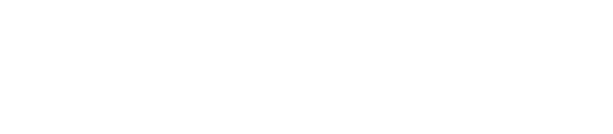

# OH Yoonseok (오윤석)

### AI 기술을 감각적인 경험과 세계관으로 변환하는 AI Native Builder

  
  

  
  
  
  

  
  
  
  
  
  
  

---

## About

안녕하세요, **AI 기술을 사용자 경험과 세계관으로 변환하는 AI Native Builder 오윤석**입니다.  
문제 정의 → 기획 → 풀스택 개발 → 배포 → 운영 자동화까지 end-to-end delivery를 수행하며,  
매주 AI 프로덕트를 만들고 공개하는 **Build in Public 실험(N2F)** 을 운영 중입니다.

| | |
|---|---|
| 🏆 OBA Weekend-thon **메인 트랙 OpenAI Build Award 1위** ($25,000) | 🏆 피싱·스캠 예방 경진대회 **대상(1위)** — 경찰청장 감사장 |
| 🏆 CMC Demo Day **AI-Soom 대상(1위)** | 🤖 2026 AI Champion 대회 **본선 진출** (N2F Wiki) |
| 🔒 NAVER PER 명예의 전당 **2년 연속** | 🎖 AI TOP 100 Finalist (3,000명 중 100인) |
| 📦 Claude Code + Codex Plugin Marketplace 배포 | 🟡 카카오 AI 앰배서더 Kanana 429 |

---

## Featured Projects

<table>
  <tr>
    <td width="50%" valign="top">
      
      <h3>🍀 Lucky Matching</h3>
      
사주(오행)를 분석해 오늘 나와 맞는 국내 여행지를 추천하고, 실제 여행 상품까지 연결하는 개인화 서비스. AI가 텍스트가 아닌 지도·카드 UI를 생성(GGUI)해 답하고, Myrealtrip MCP로 실제 상품과 잇는다. 기획·풀스택·배포를 1인 end-to-end로 수행.

      
<b>🏆 OBA Weekend-thon S1 — 메인 트랙 OpenAI Build Award 1위 ($25,000 크레딧)</b>

      
<code>Next.js</code> <code>FastAPI</code> <code>OpenAI Agents SDK</code> <code>GGUI</code> <code>MCP</code>

      

        <a href="https://github.com/lux-02/OBA_Darkwinterlab_LuckyMatching">Repo</a> ·
        <a href="https://luckymatching.n2f.site/?utm_source=github&utm_medium=readme&utm_campaign=oba_award">Service</a>
      

    </td>
    <td width="50%" valign="top">
      
      <h3>🔍 Blind Challenge</h3>
      
OSINT 기반 피싱 사전 차단 서비스. 네이버 블로그 소유권 인증 + LLM·Rule-based 하이브리드 민감 정보 탐지 + Privacy-by-Design(무저장) 아키텍처.

      
<b>🏆 데이터유니버스 × 경찰청 피싱·스캠 예방 대회 대상(1위) — 647명 중 1위, 경찰청장 감사장</b>

      
<code>Next.js</code> <code>TypeScript</code> <code>OpenAI</code> <code>React Flow</code>

      

        <a href="https://github.com/lux-02/Blind_Challenge">Repo</a> ·
        <a href="https://www.asiae.co.kr/article/2026022715182359896">아시아경제 보도</a> ·
        <a href="https://dacon.io/competitions/official/236666/talkboard/416456">데이콘 인터뷰</a>
      

    </td>
  </tr>
  <tr>
    <td width="50%" valign="top">
      
      <h3>🌬️ AI-Soom (EPI-LOG)</h3>
      
실시간 위치 기반 대기질·날씨 데이터를 아이 연령·질환에 맞는 외출 행동 가이드로 변환하는 AI 서비스. 웹앱 + 토스 미니앱 동시 출시.

      
<b>🏆 1st BUG CMC Demo Day 대상(1위) — 기획 + 풀스택 End-to-End 리드</b>

      
<code>Next.js</code> <code>FastAPI</code> <code>OpenAI RAG</code> <code>Toss Mini App</code>

      

        <a href="https://ai-soom.site">Service</a> ·
        <a href="https://github.com/CMC-EPI-LOG/EPI-LOG-MAIN">Web Repo</a> ·
        <a href="https://github.com/CMC-EPI-LOG/EPI-LOG-AI">AI Repo</a>
      

    </td>
    <td width="50%" valign="top">
      
      <h3>🛡️ 클릭전 (ClickJeon)</h3>
      
구글 검색 결과에서 버튼 하나로 AI가 각 링크를 5단계 위험 등급으로 분석. WARNING·DANGER는 블러 처리 + 클릭 차단. SEO 포이즈닝 실제 사례(카카오톡 위장, Winos4.0 C2 백도어) 기반 설계.

      
<b>📦 Chrome 웹스토어 + 네이버 웨일 스토어 등록 완료(2026.05) · 오픈소스 공개</b>

      
<code>Chrome Extension MV3</code> <code>FastAPI</code> <code>GPT</code> <code>Upstash Redis</code>

      

        <a href="https://github.com/lux-02/ClickJeon">Repo</a> ·
        <a href="https://clickjeon.n2f.site">Service</a> ·
        <a href="https://chromewebstore.google.com/detail/inopiebmhgffoijdijpimkbmkicbeejh">Chrome</a> ·
        <a href="https://store.whale.naver.com/detail/nhpnnlhomdaheccmmcoikdmaacicmbbj">Whale</a>
      

    </td>
  </tr>
  <tr>
    <td width="50%" valign="top">
      
      <h3>✍️ Korean UX Copy</h3>
      
AI로 만든 앱의 어색한 한국어 UX 문구를 진단·수정하는 Claude Code + Codex 플러그인. 15개 규칙(KA-100~KA-152)으로 진단하고 Kanana를 정제 레이어로 활용. GPT 생성 SaaS 카피 5종 E2E 검증: 55개 중 40개(73%) 감지.

      
<b>📦 Claude Code + Codex Plugin Marketplace 공개 배포</b>

      
<code>JavaScript</code> <code>Kakao Kanana API</code>

      

        <a href="https://github.com/lux-02/korean-ux-copy">Repo</a>
      

    </td>
    <td width="50%" valign="top">
      
      <h3>📧 Naver Mail Analyzer</h3>
      
SPF/DKIM/DMARC 이메일 인증 검증 + LLM 기반 본문 긴급성·스타일 분석 + VirusTotal 악성 URL 조회. 크롬 확장 + 웨일 브라우저 확장 + 웹앱 동시 제공.

      
<b>📦 Chrome 웹스토어 + 네이버 웨일 스토어 등록 완료</b>

      
<code>React</code> <code>FastAPI</code> <code>Gemini</code>

      

        <a href="https://github.com/lux-02/spam_analyzer_web">Repo</a> ·
        <a href="https://mail.n2f.site">Service</a> ·
        <a href="https://chromewebstore.google.com/detail/naver-mail-analyzer/egiihcmplomfonhicnabpifjpgkhcimi">Chrome</a> ·
        <a href="https://store.whale.naver.com/detail/iifpjpbmgopecnfibfnakgobibghhien">Whale</a>
      

    </td>
  </tr>
  <tr>
    <td width="50%" valign="top">
      
      <h3>🏅 AI Contest Cloud</h3>
      
한국 대학생·취준생을 위한 AI 공모전 탐색 + 전략 분석 + 팀 시뮬레이션 플랫폼. Circuit breaker·dedup·retry·SSE 기반 프로덕션 수준 아키텍처.

      
<code>Next.js</code> <code>FastAPI</code> <code>Supabase</code> <code>Upstash Redis</code> <code>OpenAI</code>

      

        <a href="https://github.com/lux-02/ai-contest.cloud">Repo</a> ·
        <a href="https://www.ai-contest.cloud">Service</a>
      

    </td>
    <td width="50%" valign="top">
      
      <h3>🧬 본결 (Bongyeol)</h3>
      
공개 Cloninger 7차원 이론 기반의 무료 기질·성격 자가이해 검사. 가입 없이 5분, 7차원 결과 + AI가 1:1 상담하듯 써 주는 상세 리포트. 자체 문항·12 아키타입·브랜딩·SEO/GEO·퍼널 분석까지 1인 end-to-end. 공식 검사와 무관한 독립 도구·비진단 포지셔닝.

      
<code>Next.js</code> <code>TypeScript</code> <code>OpenAI</code> <code>Vercel</code>

      

        <a href="https://bongyeol.n2f.site/?utm_source=github&utm_medium=readme&utm_campaign=week08">Service</a> ·
        <a href="https://bongyeol.n2f.site/guide">Guide</a>
      

    </td>
  </tr>
</table>

---

## N2F — One Build Per Week

> 매주 실제 문제를 정의하고 AI 프로덕트를 기획·개발·배포하는 Build in Public 실험.  
> `[product].n2f.site` 형태로 배포. 빌드 로그는 Darkwinter Lab 채널에 공개.

| 서비스 | 설명 |
|--------|------|
| [luckymatching.n2f.site](https://luckymatching.n2f.site/?utm_source=github&utm_medium=readme&utm_campaign=oba_award) | 사주 오행 기반 개인화 여행 추천 — GGUI 생성형 UI + Myrealtrip 연계 (**OBA Weekend-thon 메인 트랙 OpenAI Build Award 1위 $25,000**) |
| [bongyeol.n2f.site](https://bongyeol.n2f.site/?utm_source=github&utm_medium=readme&utm_campaign=week08) | 7가지 차원으로 보는 무료 기질·성격 검사 + AI 상세 리포트 — 공개 학술 이론 기반 독립 도구·비진단 |
| [naegyeot.n2f.site](https://naegyeot.n2f.site) | Memory-first AI 소울메이트 — raw transcript 비저장 + compact memory 구조 |
| [kanana.n2f.site](https://kanana.n2f.site) | Kakao Kanana · GPT · Gemini · Claude 멀티 LLM 비교 실험 도구 |
| [wiki.n2f.site](https://wiki.n2f.site) | N2F Wiki — Ontology Knowledge Graph 기반 크리에이터 이해·탐색 AI 플랫폼 (**2026 AI Champion 본선 진출**) |
| [mail.n2f.site](https://mail.n2f.site) | 네이버 메일 스팸 탐지 — SPF/DKIM/DMARC + LLM 분석 ([Chrome](https://chromewebstore.google.com/detail/naver-mail-analyzer/egiihcmplomfonhicnabpifjpgkhcimi) · [Whale](https://store.whale.naver.com/detail/iifpjpbmgopecnfibfnakgobibghhien)) |
| [matzip.n2f.site](https://matzip.n2f.site) | 저장 맛집 리스트 기반 오늘 갈 곳 AI 추천 |
| [strudel.n2f.site](https://strudel.n2f.site) | 이미지 → 색·감정 분석 → Strudel 코드 + 라이브 비주얼라이저 |
| [ufo.n2f.site](https://ufo.n2f.site) | FBI UFO 극비 문서 1,616p 한국어 아카이브 (8단계 OCR 파이프라인) |
| [clickjeon.n2f.site](https://clickjeon.n2f.site) | SEO 포이즈닝·피싱 실시간 차단 Chrome·웨일 확장 ([Chrome](https://chromewebstore.google.com/detail/inopiebmhgffoijdijpimkbmkicbeejh) · [Whale](https://store.whale.naver.com/detail/nhpnnlhomdaheccmmcoikdmaacicmbbj)) |

---

## Awards & Recognition

| 연도 | 수상 |
|------|------|
| 2026.05 | 🥇 OBA Weekend-thon S1 **메인 트랙 OpenAI Build Award 1위** ($25,000 크레딧) — Lucky Matching |
| 2026.03 | 🥇 1st BUG CMC Demo Day **대상(1위)** — AI-Soom |
| 2026.02 | 🥇 피싱·스캠 예방 서비스 개발 경진대회 **대상(1위)** + 경찰청장 감사장 (647명 중 1위) |
| 2025.11 | 🎖 **AI TOP 100 Finalist** — 카카오임팩트 × 브라이언임팩트 (3,000명 중 100인) |
| 2024.12 | 🥈 2024 한이음 ICT 멘토링 공모전 **은상** — 01:11 |
| 2024–2025 | 🔒 **NAVER PER 명예의 전당 2년 연속** (개인정보취약점 제보) |
| 2024.02 | 🥇 K-Digital 정보보호 전문가 **최우수 플레이어(전체 1위)** + 우수 프로젝트 |

---

## Current Roles

- 🟡 **카카오 AI 앰배서더 Kanana 429** (2026.03 ~ 현재) — Kanana API 기반 Agentic AI 실험 및 개발자 커뮤니티 공유
- 🔵 **2026 전국민 AI 경진대회 국민 홍보대사** (과학기술정보통신부, 2026.03 ~ 현재) — 200만 명 규모 경진대회 홍보
- 🟢 **NAVER AI RUSH 2023 대학생 앰배서더** — HyperCLOVA X 기반 AI 서비스 기획

---

## Core Stack

- **Frontend** — Next.js · React · TypeScript · Tailwind CSS
- **Backend** — Python (FastAPI) · Node.js
- **AI/LLM** — OpenAI · Gemini · Kakao Kanana · RAG · Prompt Engineering · Multi-LLM
- **Data/Infra** — MongoDB · Supabase · Upstash Redis · AWS · Vercel · GitHub Actions
- **Security** — OSINT · SPF/DKIM/DMARC · Privacy-by-Design · 정적 분석 · 취약점 분석
- **Extensions** — Chrome Extension MV3 · Whale Browser Extension · Claude Code Plugin

---

## Contact

- LinkedIn: [linkedin.com/in/lux00](https://www.linkedin.com/in/lux00/)
- Email: `darkwinterlab@gmail.com`
- Build in Public: [N2F](https://n2f.site) | Darkwinter Lab

 

  
  
Null → Full. 매주 하나씩.

